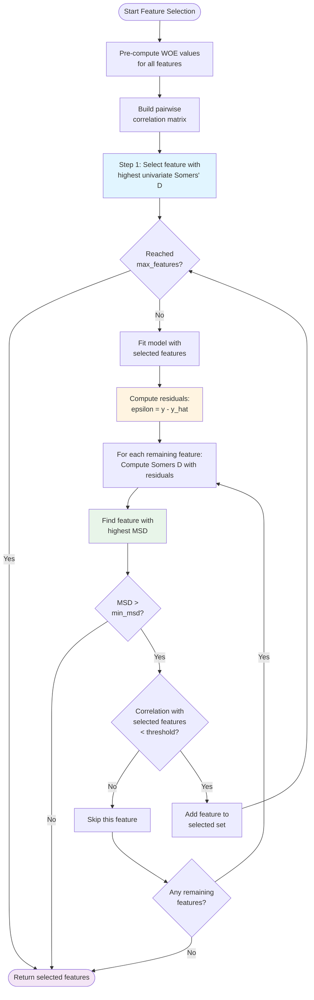
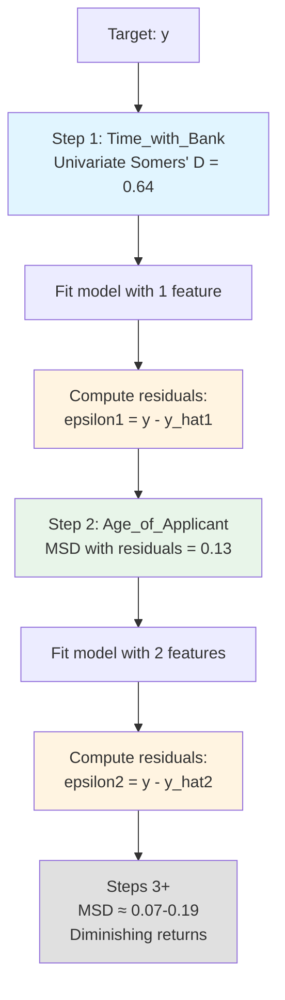

# Marginal Somers' D (MSD) for Feature Selection

**Denis Burakov** | **December 2025** | **xRiskLab**

<div align="center">

[](https://github.com/xRiskLab/fastwoe)
[](https://pypi.org/project/fastwoe/)

**Fast and efficient Python implementation of WOE encoding and MSD feature selection**

</div>

## 1. Introduction

**Marginal Somers' D (MSD)** is a feature selection method that uses rank correlation (Somers' D) instead of traditional Information Value (IV). It implements greedy forward selection that:

1. Transforms features using WOE encoding
2. Selects features based on their Somers' D with residuals (y - current_predictions)
3. Filters out features highly correlated with already-selected features
4. Works with both binary and continuous targets

**Key advantage:** Unlike IV-based methods limited to binary classification, MSD handles continuous targets through rank correlation.

**Truly marginal:** The algorithm measures against residuals, making it truly "marginal" by selecting features that explain what the current model doesn't capture. This relies on **rankable variance** - the portion of residual variance that can be captured by rank correlation (monotonic relationships).

## 2. Mathematical Foundation

### Somers' D Definition

Somers' D measures monotonic association between two variables:

```math
D_{Y|X} = \frac{\text{Concordant} - \text{Discordant}}{\text{Total pairs (excluding ties in Y)}}
```

Where:
- **Concordant**: $(x_i > x_j \text{ and } y_i > y_j)$ or $(x_i < x_j \text{ and } y_i < y_j)$
- **Discordant**: $(x_i > x_j \text{ and } y_i < y_j)$ or $(x_i < x_j \text{ and } y_i > y_j)$

For binary classification:

```math
\text{Gini} = 2 \times \text{AUC} - 1 = D_{Y|X}
```

### WOE Transformation

All features are transformed using Weight of Evidence (WOE) before computing Somers' D. This:
- Handles categorical variables
- Creates monotonic transformations
- Works with both binary and continuous targets

## 3. The Marginal Somers' D Algorithm

### Step-by-Step Process

1. **Pre-processing**
   - Transform all features using WOE encoding
   - Compute pairwise Somers' D correlation matrix between features

2. **Initialization (Step 1)**
   - Calculate univariate Somers' D for each feature with target y
   - Select feature with highest univariate Somers' D (no residuals yet)

3. **Iterative Selection (Step 2 onwards)**
   - Fit model with currently selected features
   - Compute residuals: ε = y - model.predict_proba()
   - For each remaining feature:
     - Compute Somers' D between feature WOE and residuals (marginal contribution)
     - Check correlation with already-selected features (using pre-computed matrix)
   - Select feature with highest |D(ε, feature)| if correlation < threshold
   - Repeat until stopping criteria met

4. **Stopping Criteria**
   - MSD < `min_msd`, OR
   - Maximum features reached, OR
   - All remaining features too correlated with selected features

### Algorithm Flowchart



### What Makes It "Marginal"?

The "marginal" aspect comes from measuring against residuals:

- **Step 1**: Uses univariate Somers' D with target y (no model exists yet)
- **Step 2+**: Measures Somers' D against residuals (ε = y - current_predictions)
- **Marginal selection**: Each new feature is selected based on how well it explains what the current model doesn't capture
- **Rankable variance**: Features are selected based on their ability to explain monotonic patterns in residuals

> [!NOTE]
> **Residual-based selection starts from Step 2.** The method captures only rankable variance—monotonic relationships between features and residuals. Non-monotonic patterns cannot be detected by rank correlation.

### The Algorithm in Plain English

**Step 1**: Select the feature with highest univariate Somers' D with the target.

**Steps 2+**: At each subsequent step:

1. **Fit model** with currently selected features
2. **Compute residuals**: ε = y - predictions (what the model doesn't explain)
3. **Test each remaining feature**: "Can your WOE values rank the residuals? Do high WOE values correspond to positive errors and low WOE values to negative errors?"
4. **Select winner**: Feature whose WOE values best rank the residuals
5. **Repeat**: Residuals shrink and change, so rankings change

Features are automatically penalized if redundant—they can't rank residuals well when the variance they'd explain is already captured by selected features.

### Understanding Marginal Somers' D History



MSD values typically show this pattern:

- **Step 1**: High (e.g., 0.64) - univariate Somers' D with target
- **Step 2**: Sharp drop (e.g., 0.13) - measuring against residuals instead
- **Step 3+**: Gradual decrease (e.g., 0.07-0.19) - less residual variance to explain

**This drop is expected and correct.** Step 1 measures correlation with the original target. From Step 2 onwards, MSD measures correlation with residuals—what the current model doesn't explain. Since residuals are smaller and have different distributions than the original target, MSD values are naturally lower.

**Why values aren't additive**: Somers' D is a rank correlation measure, not a variance proportion. You cannot add 0.64 + 0.13 to get total model performance. Instead, evaluate the final model's overall Somers' D on held-out data.

Feature correlation is computed as:

```math
\text{correlation}(f_i, f_j) = \frac{|D_{f_i|f_j}| + |D_{f_j|f_i}|}{2}
```

## 4. Basic Usage

### Binary Classification

```python
import numpy as np
import pandas as pd
from fastwoe.screening import marginal_somersd_selection

# Prepare data
X = pd.DataFrame({
    'feature1': np.random.choice(['A', 'B', 'C'], 1000),
    'feature2': np.random.choice(['X', 'Y', 'Z'], 1000),
    'feature3': np.random.choice(['P', 'Q', 'R'], 1000),
})
y = np.random.binomial(1, 0.3, 1000)

# Run marginal selection (Step 1: univariate, Step 2+: residual-based)
result = marginal_somersd_selection(
    X, y,
    min_msd=0.01,              # Minimum MSD
    max_features=5,            # Maximum features
    correlation_threshold=0.5  # Correlation threshold
)

print(result['selected_features'])
print(result['msd_history'])
```

### With Train/Test Split

```python
from sklearn.model_selection import train_test_split

X_train, X_test, y_train, y_test = train_test_split(
    X, y, test_size=0.3, random_state=42
)

result = marginal_somersd_selection(
    X_train, y_train,
    X_test=X_test,
    y_test=y_test,
    min_msd=0.01
)

# Monitor performance at each step
# Note: test_performance has length len(selected_features) - 1
# (computed at start of each iteration after first feature)
for i, (feat, msd) in enumerate(
    zip(result["selected_features"], result["msd_history"])
):
    if i > 0:  # test_performance starts from step 2
        test_perf = result["test_performance"][i - 1]
        print(f"{feat}: Train MSD={msd:.4f}, Test D={test_perf:.4f}")
    else:
        print(f"{feat}: Train MSD={msd:.4f}")
```

### Continuous Target

```python
# Works with continuous targets
y_continuous = np.random.normal(0, 1, 1000)

result = marginal_somersd_selection(
    X, y_continuous,
    min_msd=0.01
)
```

## 5. Output Structure

The function returns a dictionary with:

| Key | Type | Description |
|-----|------|-------------|
| `selected_features` | `list[str]` | Feature names in selection order |
| `msd_history` | `list[float]` | MSD at each step (same length as selected_features) |
| `univariate_somersd` | `dict[str, float]` | Univariate Somers' D for all features |
| `model` | `FastWoe` | Trained WOE model with selected features |
| `test_performance` | `list[float]` | Test set Somers' D after adding each feature. Starts from Step 2 (after first feature added), so length = len(selected_features) - 1 |
| `correlation_matrix` | `pd.DataFrame` | Pairwise correlations of selected features |

## 6. Complete Example

```python
import numpy as np
import pandas as pd
from fastwoe.screening import marginal_somersd_selection
from sklearn.metrics import roc_auc_score
from sklearn.model_selection import train_test_split

# Generate data
np.random.seed(42)
n = 2000
X = pd.DataFrame({
    'age_group': np.random.choice(['18-25', '26-35', '36-45', '46+'], n),
    'income': np.random.choice(['Low', 'Medium', 'High'], n),
    'employment': np.random.choice(['Employed', 'Self-Employed', 'Unemployed'], n),
    'education': np.random.choice(['HS', 'Bachelor', 'Master', 'PhD'], n),
})

# Create target
y = (
    (X['income'] == 'High').astype(int) * 0.3 +
    (X['education'].isin(['Master', 'PhD'])).astype(int) * 0.2 +
    np.random.normal(0, 0.1, n)
)
y = (y > 0.3).astype(int)

# Split
X_train, X_test, y_train, y_test = train_test_split(
    X, y, test_size=0.3, stratify=y, random_state=42
)

# Select features (Step 1: univariate, Step 2+: residual-based)
result = marginal_somersd_selection(
    X_train, y_train,
    X_test=X_test,
    y_test=y_test,
    min_msd=0.01,
    max_features=5
)

# Results
print("Selected features:", result["selected_features"])
print("\nUnivariate Somers' D:")
for feat, val in sorted(
    result["univariate_somersd"].items(), key=lambda x: x[1], reverse=True
):
    print(f"{feat}: {val:.4f}")

# Evaluate
model = result["model"]
y_pred = model.predict_proba(X_test[result["selected_features"]])[:, 1]
print(f"\nTest AUC: {roc_auc_score(y_test, y_pred):.4f}")
```

## References

1. Somers, R.H. (1962). A New Asymmetric Measure of Association for Ordinal Variables. *American Sociological Review*, 27(6), 799-811.

2. Spinella, F., & Krisciunas, T. (2025). Enhancing Credit Risk Models at Revolut by Combining Deep Feature Synthesis and Marginal Information Value. *Credit Research Centre, University of Edinburgh Business School*. Available at: https://www.crc.business-school.ed.ac.uk/sites/crc/files/2025-11/Enhancing-Credit-Risk-Models-at-Revolut-by-combining-Deep-Feature-Synthesis-and-Marginal-Information-Value-paper.pdf.
