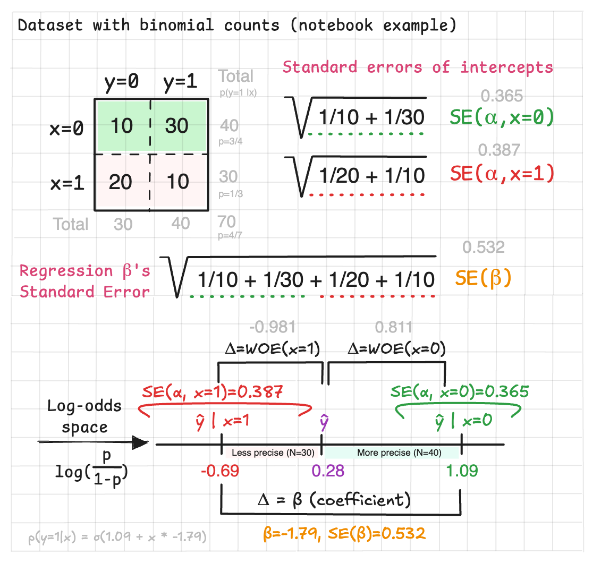

# Weight of Evidence (WOE), Log Odds, and Standard Errors

<div align="center">

**Denis Burakov** | **June 2025** | **xRiskLab**

</div>

---

<div align="center">

[](https://github.com/xRiskLab/fastwoe)
[](https://pypi.org/project/fastwoe/)

</div>

---

This document explains:

- How **WOE** is a centered version of **log odds**
- Why **WOE and log odds have the same standard error**
- That **subtracting the prior log odds (a constant) does not affect variance**
- Includes a Python simulation to demonstrate this as well as comparison with logistic regression

---

## 📊 1. Definitions

### Log odds for a binary feature group:

Let `n₁₁` = positives in group 1  
Let `n₁₀` = negatives in group 1  

```math
θ₁ = log(n₁₁/n₁₀)
```

### Global (prior) log odds:

Let `n_pos` = total positives, `n_neg` = total negatives:

```math
θ_prior = log(n_pos/n_neg)
```

### Weight of Evidence (WOE):

```math
WOE₁ = θ₁ - θ_prior
```

---

## 📐 2. Variance and Standard Error

> [!NOTE]
> **Basic Property of Variance:** The variance of a random variable remains unchanged when a constant is subtracted from it.
> 
> ```math
> Var(X - c) = Var(X)
> ```
> 
> This property is the cornerstone of our analysis. For more details on variance properties, see [this discussion](https://math.stackexchange.com/questions/3083350/wald-test-for-variance-of-normal-distribution).

### SE of log odds:

```math
Var(θ₁) = 1/n₁₁ + 1/n₁₀
```

Therefore:

```math
SE(θ₁) = √(1/n₁₁ + 1/n₁₀)
```

### SE of WOE:

```math
WOE₁ = θ₁ - θ_prior
```

Therefore:

```math
Var(WOE₁) = Var(θ₁)
```

> [!IMPORTANT]
> **Why Standard Errors Are Identical**
> 
> Because subtracting a constant does not change variance:
> ```math
> Var(X - c) = Var(X)
> ```
> 
> The prior log odds `θ_prior` is a **fixed constant** calculated from the entire dataset. When we subtract this constant from the log odds to obtain WOE, the variability (and hence standard error) remains exactly the same.

---

## 🎯 3. Difference of WOE = Coefficient in Logistic Regression

For two groups:

```math
β = θ₁ - θ₀ = WOE₁ - WOE₀
```

```math
Var(β) = Var(WOE₁) + Var(WOE₀)
```

---

## 🧪 4. Python Simulation Example

> [!TIP]
> **Empirical Verification**
> 
> Below we provide a simulation for the effect of constant in the variance calculation. We create 10,000 iterations by sampling from a binomial distribution and calculate the variance of log-odds and WOE.

```python
import numpy as np
import pandas as pd

np.random.seed(42)

# True probabilities
p1 = 30 / (30 + 20)  # x=1 group
p0 = 10 / (10 + 40)  # x=0 group
prior_p = (30 + 10) / (30 + 10 + 20 + 40)

# Sample sizes
n1_total = 50  # x=1 group total
n0_total = 50  # x=0 group total

# Number of simulations
n_sim = 10_000

# Store results
log_odds_1_samples = []
woe_1_samples = []

for _ in range(n_sim):
    # Simulate binary outcomes for x=1 group
    y1 = np.random.binomial(1, p1, size=n1_total)
    n11 = y1.sum()      # y=1, x=1
    n10 = n1_total - n11  # y=0, x=1

    # Compute log odds
    if n11 > 0 and n10 > 0:
        log_odds_1 = np.log(n11 / n10)
        log_odds_prior = np.log(prior_p / (1 - prior_p))
        woe_1 = log_odds_1 - log_odds_prior

        log_odds_1_samples.append(log_odds_1)
        woe_1_samples.append(woe_1)

# Convert to arrays
log_odds_1_samples = np.array(log_odds_1_samples)
woe_1_samples = np.array(woe_1_samples)

# Compare empirical variances
variance_log_odds = np.var(log_odds_1_samples, ddof=1)
variance_woe = np.var(woe_1_samples, ddof=1)

print(f"Empirical Variance (Log Odds): {variance_log_odds:.4f}")
print(f"Empirical Variance (WOE): {variance_woe:.4f}")
print(f"Difference: {abs(variance_log_odds - variance_woe):.4f}")
```

**Results:** The results confirm that adding or subtracting a constant does not change the variance:

<table align="center">
<tr><td><strong>Metric</strong></td><td><strong>Value</strong></td></tr>
<tr><td>Empirical Variance (Log Odds)</td><td>0.0890</td></tr>
<tr><td>Empirical Variance (WOE)</td><td>0.0890</td></tr>
<tr><td>Difference</td><td>0.0000</td></tr>
</table>

This means that the centering of log-odds through WOE transformation does not affect the standard error.

---

## 📈 5. Logistic Regression Example

> [!TIP]
> **Connecting WOE to Logistic Regression**
> 
> In this section, we provide examples from logistic regression to demonstrate that the standard error (SE) of the Weight of Evidence (WOE) is linked to the variability of log odds per row and is not influenced by the centering effect.

### Data

We will use the following contingency table:

<div align="center">

|        | y=0 | y=1 | Row Sum |
|--------|-----|-----|---------|
| **x=0** | 10  | 30  | 40      |
| **x=1** | 20  | 10  | 30      |
| **Total** | 30  | 40  | 70      |

</div>

From the table above, we can derive the log odds for P(y=1|x=0) and P(y=1|x=1):

**For x=0:**
```math
log(P(y=1|x=0)/P(y=0|x=0)) = log(30/10) = log(3) ≈ 1.099
```

**For x=1:**
```math
log(P(y=1|x=1)/P(y=0|x=1)) = log(10/20) = log(0.5) ≈ -0.693
```

### Logistic Regression Results

Converting this table to Bernoulli format and fitting logistic regression with **x=0** as intercept:

<div align="center">

| Parameter | Estimate | Std. Error | Wald Statistic | P-value | Lower CI | Upper CI |
|-----------|----------|------------|----------------|---------|----------|----------|
| intercept (x=0) | 1.0986 | **0.3651** | 3.0087 | 0.0026 | 0.3829 | 1.8143 |
| beta (x=1) | -1.7918 | **0.5323** | -3.3661 | 0.0008 | -2.8350 | -0.7485 |

</div>

With **x=1** as intercept:

<div align="center">

| Parameter | Estimate | Std. Error | Wald Statistic | P-value | Lower CI | Upper CI |
|-----------|----------|------------|----------------|---------|----------|----------|
| intercept (x=1) | -0.6931 | **0.3873** | -1.7897 | 0.0735 | -1.4522 | 0.0659 |
| beta (x=0) | 1.7918 | **0.5323** | 3.3661 | 0.0008 | 0.7485 | 2.8350 |

</div>

### Standard Error Calculations

We can derive these standard errors from our 2×2 table:

```math
SE(x=0) = √(1/10 + 1/30) = 0.3651
```

```math
SE(x=1) = √(1/20 + 1/10) = 0.3873
```

The beta standard error is the square root of the pooled variance:

```math
SE(β) = √(SE(x=0)² + SE(x=1)²) = √(0.3651² + 0.3873²) = 0.5323
```

---

## ⚖️ 6. Weight of Evidence (WOE) Calculation

Converting to conditional probabilities:

<div align="center">

| p(x\|y) | y=0 | y=1 | **WOE** |
|---------|-----|-----|---------|
| **x=0** | 0.333 | 0.750 | **0.811** |
| **x=1** | 0.667 | 0.250 | **-0.981** |
| **Total** | 1.000 | 1.000 | - |

</div>

**WOE Calculations:**

```math
WOE(x=0) = ln(0.750/0.333) = ln(2.25) ≈ 0.811
```

```math
WOE(x=1) = ln(0.250/0.667) = ln(0.375) ≈ -0.981
```

**Base log odds:**

```math
Base log odds = ln(40/30) = ln(4/3) ≈ 0.288
```

### WOE Confidence Intervals

Using WOE to calculate 95% confidence intervals:

```math
\mathrm{WOE}(x=0)_{95\%\ \mathrm{CI}} = 0.288 + (0.811 × 1.96 × 0.3651) ≈ 0.288 + 0.576 = 1.8143
```

```math
\mathrm{WOE}(x=1)_{95\%\ \mathrm{CI}} = 0.288 + (-0.981 × 1.96 × 0.3873) ≈ 0.288 - 0.731 = 0.0659
```

> [!NOTE]
> Notice that these values correspond exactly to the intercept confidence intervals from the logistic regression outputs!

---

## 💡 7. Implications

By understanding the properties of standard errors for WOE-transformed variables, we can derive valuable insights about the log of the likelihood ratios in predictive modeling:

- **🎯 Uncertainty Identification**: Standard errors help identify bins with the most uncertainty due to sampling variability
- **📊 Effect Assessment**: Large absolute WOEs can be misleading due to low sample sizes
- **🔍 Confidence Intervals**: Crucial for interpreting model predictions and making informed decisions
- **📈 Model Reliability**: Highlight areas where additional data might be needed

> [!WARNING]
> **Key Takeaway:** The centering operation in WOE transformation does not affect the uncertainty (standard error) of the estimates, making WOE a reliable transformation for feature engineering in machine learning and statistical modeling.

---

## 🐍 8. Python Implementation

You can find the complete Python implementation in the [**FastWoe**](https://github.com/xRiskLab/fastwoe) package:

```bash
pip install fastwoe
```

<div align="center">

[](https://github.com/xRiskLab/fastwoe)

*Fast and efficient Python implementation of WOE encoding and inference*

</div>

### Quick Example

```python
from fastwoe import FastWoe
import pandas as pd

# Your data
df = pd.DataFrame({
    'category': ['A', 'B', 'A', 'B', 'C'],
    'target': [1, 0, 1, 1, 0]
})

# Apply WOE encoding with confidence intervals
woe = FastWoe()
woe_encoded = woe.fit_transform(df[['category']], df['target'])

# Get detailed mapping with standard errors
mapping = woe.get_mapping('category')
print(mapping[['category', 'woe', 'woe_se', 'count']])
```

---

## 📚 9. References

<div align="left">

1. **Good, I.J.** (1950). *Probability and the Weighing of Evidence*. London: Griffin.

2. **Turing, A.M.** (1942). *The Applications of Probability to Cryptography*.

3. **Micci-Barreca, D.** (2001). *A preprocessing scheme for high-cardinality categorical attributes in classification and prediction problems*. ACM SIGKDD.

4. **Siddiqi, N.** (2006). *Credit Risk Scorecards: Developing and Implementing Intelligent Credit Scoring*. Wiley.

</div>

---

## 📎 Appendix

<div align="center">

### Visual Description of WOE, Log Odds, and Standard Errors



*Figure: A visual description of WOE and Log Odds Standard Errors showing the relationship between variance and centering operations.*

</div>

---

<div align="center">

[](https://github.com/xRiskLab/fastwoe)
[](https://pypi.org/project/fastwoe/)

</div> 